:title: Multimedia 
:data-transition-duration: 1500
:css: hovercraft.css

*MULTIMEDIA PRESENTATION*
===================================

Shivam Aggarwal - 1411073

Abhinav Handa - 1411227

Birjot Singh - 1411246

Gurnoor Singh - 1411254

----

In this presentation we are going to cover chapter: Compression , Video and Multimedia (Networking) Systems.

----

Encoder and Decoder
======================

In computers, encoding is the process of putting a sequence of characters (letters, numbers, punctuation, and certain symbols) into a specialized format for efficient transmission or storage. Decoding is the opposite process -- the conversion of an encoded format back into the original sequence of characters. Encoding and decoding are used in data communications, networking, and storage. The term is especially applicable to radio (wireless) communications systems.

----

The terms encoding and decoding are often used in reference to the processes of analog-to-digital conversion and digital-to-analog conversion. In this sense, these terms can apply to any form of data, including text, images, audio, video, multimedia, computer programs, or signals in sensors, telemetry, and control systems. Encoding should not be confused with encryption, a process in which data is deliberately altered so as to conceal its content. Encryption can be done without changing the particular code that the content is in, and encoding can be done without deliberately concealing the content.

----

Encoder and Decoder
========================
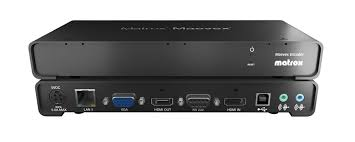

----

Color Spaces 
================

Color is the perceptual result of light in the visible region of the spectrum, having
wavelengths in the region of 380 nm to 780 nm. The human retina has three
types of color photoreceptor cells cone, which respond to incident radiation with
somewhat different spectral response curves. Because there are exactly three
types of color photoreceptor, three numerical components are necessary and
theoretically sufficient to describe a color.

----

For example, Adobe RGB and sRGB are two different absolute color spaces, both based on the RGB color model. When defining a color space, the usual reference standard is the CIELAB or CIEXYZ color spaces, which were specifically designed to encompass all colors the average human can see.

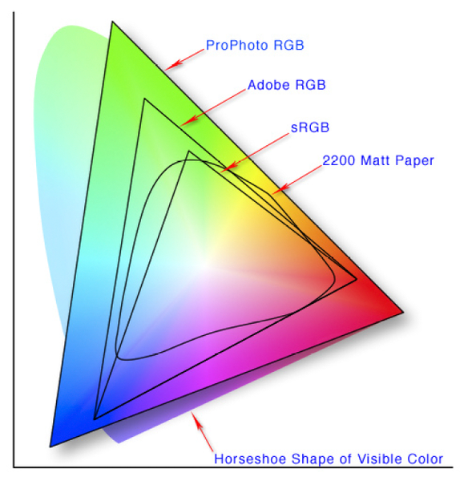

----

Conversion
==================
Color space conversion is the translation of the representation of a color from one basis to another. This typically occurs in the context of converting an image that is represented in one color space to another color space, the goal being to make the translated image look as similar as possible to the original.

----

RGB density
================
The RGB color model is implemented in different ways, depending on the capabilities of the system used. By far the most common general-used incarnation as of 2006 is the 24-bit implementation, with 8 bits, or 256 discrete levels of color per channel. Any color space based on such a 24-bit RGB model is thus limited to a range of 256×256×256 ≈ 16.7 million colors. Some implementations use 16 bits per component for 48 bits total, resulting in the same gamut with a larger number of distinct colors. 

----

Image Compression using DCT upon Various Quantization
=========================================================

Discrete cosine transform (DCT) is a widely compression technique for converting an image into elementary frequency
components. However, level of quality and compression is desired, scalar multiples of the JPEG standard quantization may be used. In this paper, DCT method was applied to compress image under various level of quality. Different quantization matrices of DCT’s coefficients are used to improve level of quality and compression ratio of JPEG image.

----

Discrete Cosine Transform (DCT) is one of many transforms that takes its image and transforms it into a linear combination of weighted basis functions. These basis functions are commonly the frequency, like sine waves. 2-D DCT of an image is defined as in Eq.(1).

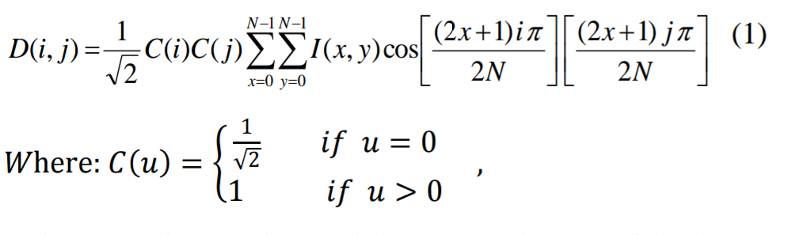

----

QUANTIZATION
==============
Quantization is the process of reducing the number of possible values of a quantity, thereby reducing the number of bits needed to represent it.

----

**Jpeg Standard Quantization**
The JPEG standard quantization matrix of the DCT coefficients with a quality level of 50 provides high
compression and excellent decompressed image quality. We can get on different level of quality and compression ratio by determine a suitable quantization matrix for DCT coefficients.

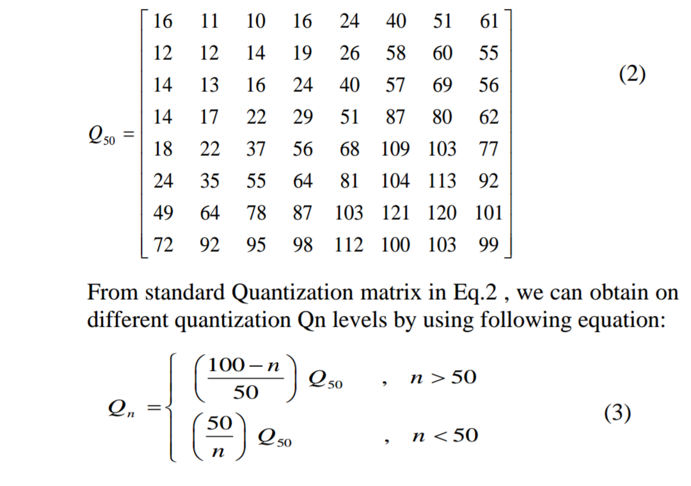

----

HUFFMAN CODING
================
Huffman coding is a form of statistical coding which attempts to reduce the amount of
bits required to represent a string of symbols. The algorithm accomplishes its goals by allowing symbols to vary in length. Shorter codes are assigned to the most frequently used symbols, and longer codes to the symbols which appear less frequently in the string (that's where the statistical part comes in).

----

PROPOSED METHOD
==================
A remarkable and highly useful feature of JPEG process is that in quantization step. Varying levels of image
compression and quality are obtained through selection of specific quantization matrices. This enables the user to decide on quality levels ranging from 1 (poorest) to 100 (Best Quality).The selection of Quantization matrix is depended on the variance of each block in image.

----

ALGORITHM
===========

The image is divided into (8×8) blocks of pixels. DCT is applied to each block from right to left, top to
bottom. The variances of each DCT’s coefficients blocks are calculated. The blocks are divided into three classes based on value of their variance [high , medium , low]. Each class (high , medium , low) is compressed through corresponding Quantization matrix (Q90 , Q50 , Q10) respectively. The compressed blocks that constitute the image is encoded with Huffman code and stored in a drastically reduced amount of space. Finally the image is reconstructed through decompression using IDCT (Inverse Discrete Cosine Transform).

----

**ALGORITHM**

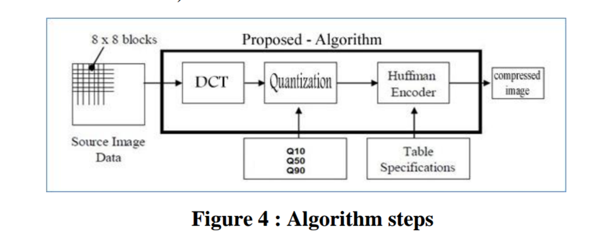

----

Compression Ratio
==================

Compression ratio, also known as compression power, is a computer science term used to quantify the reduction in data-representation size produced by a data compression algorithm.
It is used to approximate the algorithmic complexity.

----

Data compression ratio is defined as the ratio between the uncompressed size and compressed size

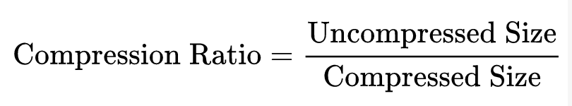

Thus a representation that compresses a 10 MB file to 2 MB has a compression ratio of 10/2 = 5

----

Artifacts
================

A distortion in an image or sound caused by a limitation or malfunction in the hardware or software. Artifacts may or may not be easily detectable.

----

Types of Artifacts
===================

1. Analog Artifacts.
2. Digital Artifacts.

----

Analog Artifacts
==================

In film, artifacts such as scratches and flicker are commonly found, especially in older movies. 

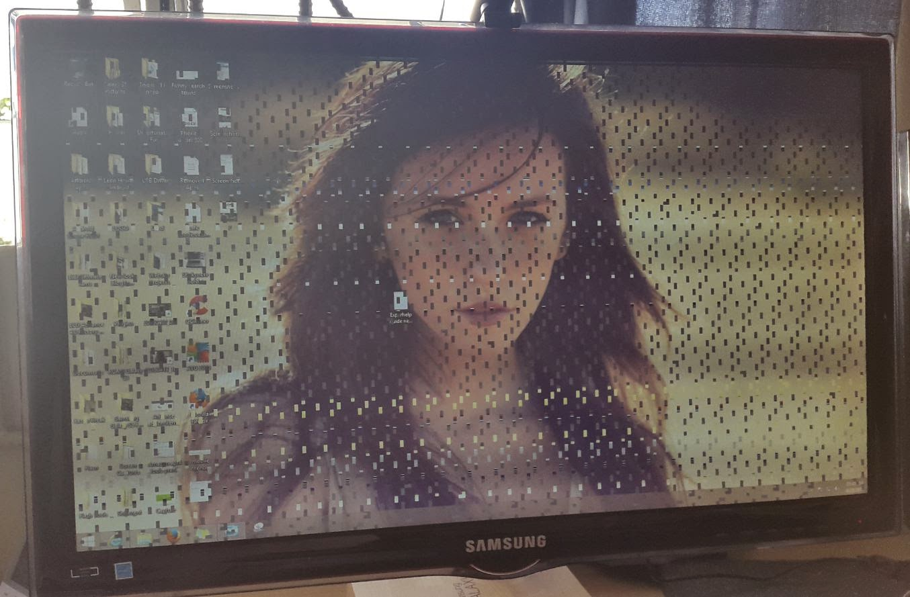
	
----

Digital Artifacts
===================
Artifacts are a natural byproduct of digital compression methods such as JPEG and MPEG, which permanently discard pixels. The greater the compression used, the more artifacts are likely, and fast motion sequences are a major contributor. As TV screens become larger, the distortions are more noticeable.

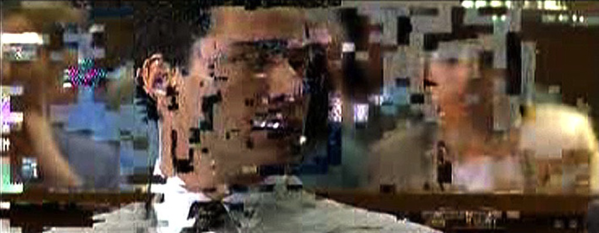

----

Types of Digital Artifacts
==========================

* Blocking Artifacts
* mosquito noise
* Quantization error

----

Blocking Artifact
================================

A distortion that appears in compressed video material as abnormally large pixel blocks. It occurs when the encoder cannot keep up with the allocated bandwidth. It is especially visible with fast motion sequences or quick scene changes. It is a type of Digital Artifact.

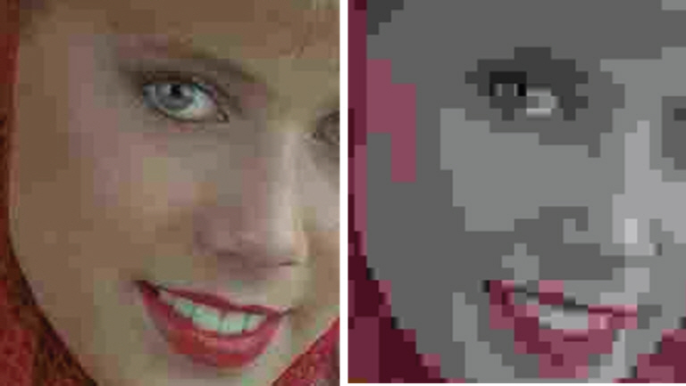

----

Video uses lossy compression, and the higher the compression rate, the more content is removed. At decompression, the output of certain decoded blocks makes surrounding pixels appear averaged together and look like larger blocks. As TVs get larger, blocking and other artifacts become more noticeable

	
It is also known as macroblocking.

----

What is a Video?
=======================

Video can be defined as number of frames per second. In other words, moving pictures with audio can be said to be as Video.

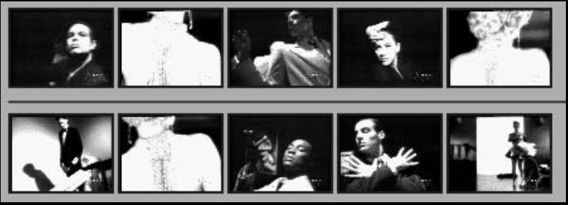

----

Video Display Progressive
================================

In this signals are displayed on the screen using a technology known as Progressive scan.

**Progressive scan**

Its is a methods used for "painting" an image on a television screen, where the lines are drawn one at a time in sequential order. In other words, in progressive scan, the image lines (or pixel rows) are scanned in numerical order (1,2,3) down the screen from top to bottom wheras in interlaced scan, lines are drawn in an alternate order which are divided in 2 fields for a single frame (lines or rows 1,3,5, etc... followed by lines or rows 2,4,6).

----

For example, with a progressive scan video at 60hz, the entire image would be refreshed 60 times per second. The fast transitions result in a smooth image.

Progressive scan is a method used in computer monitors and high-end television displays. 
To use and view progressive scanning technology the source and the display must both be progressive scan compatible.

----

Interlaced Analog Broadcast TV Systems NTSC
=================================================

Analog TV signals, such as those from a local station, cable company, or VCR was displayed on a TV screen using a technology known as Interlaced Scan.

Interlaced scanning uses two fields to create a frame. One field contains all the odd lines in the image, the other contains all the even lines of the image. A television scans 60 fields every second (30 odd and 30 even). These two sets of 30 fields are combined to create a full frame every 1/30th of a second, resulting in a display of 30 frames per second. 

----

Progressive vs Interlaced
================================

.. image:: images/picdisplay.jpg
	:height: 411px
	:width: 480px
	:class: aligncn

----

**Why Progressive is better than Interlaced?**

* more precise.
* accurate.
* detailed image.
* higher resolution.

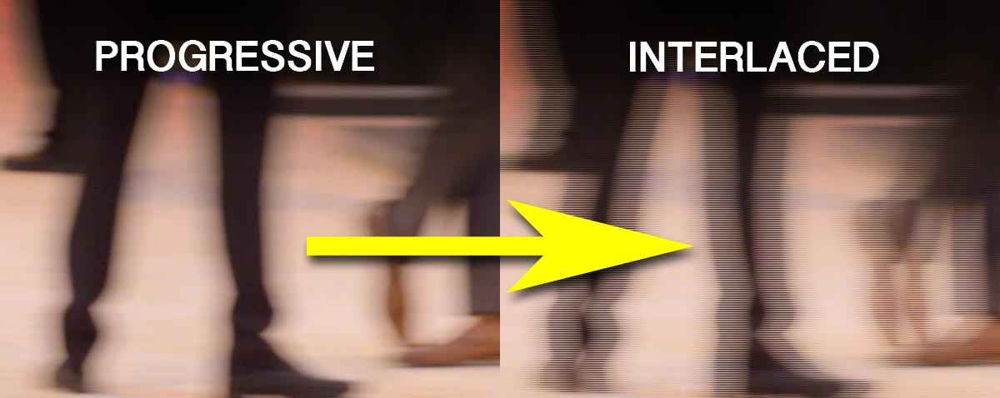

----

1080p vs 1080i
================================

* p here stands for progressive scan.
* i here stands for interlaced scan.

**Youtube**

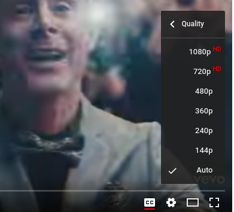

----

NTSC
=====================
NTSC is based on a system of 525-lines, 60 fields/30 frames-per-second at 60Hz for transmission and display of video images. This is an interlaced system in which each frame is scanned in two fields of 262 lines, which is then combined to display a frame of video with 525 scan lines. Countries with an NTSC foundation are the U.S., Canada, Mexico, some parts of Central and South America, Japan, Taiwan, and Korea.

----

Phase Alternating Line (PAL)
================================

Phase Alternating Line (PAL)  is a colour encoding system for analogue television used in broadcast television systems in most countries broadcasting at 625-line / 50 field (25 frame) per second (576i). 

----

**Television encoding systems by nation**

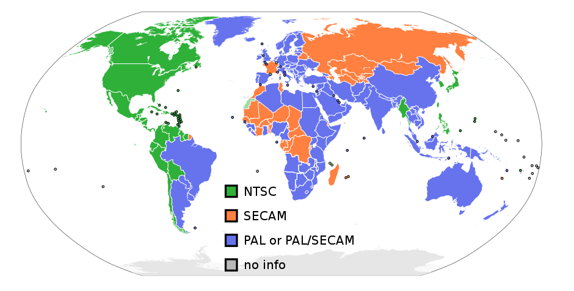

----

Similar to the NTSC system, Phase Alternating Line makes use of a quadrature amplitude modulated subcarrier which carries the chrominance data added to the video signal. The frequency for PAL is 4.43361875 MHz, while it is 3.579545 MHz for NTSC. PAL scans the cathode ray tube 625 times horizontally to form the video image. This is similar to the SECAM system. PAL makes use of a screen resolution of 720 × 576 pixels. PAL video can be converted to NTSC with the addition of extra frames. This can be done with techniques such as adaptive motion interpolation or inter-field interpolation.

----

Compared to NTSC, PAL has a more detailed picture due to the higher number of scan lines. Additionally, hues are more stable in PAL than with NTSC. Higher levels of contrast and better color reproduction are also present in PAL. Automated color correction is possible in the PAL system, unlike NTSC, which makes use of manual color correction. In fact, PAL is considered to have better picture quality than NTSC.

PAL has a slower frame rate, resulting in motion not being as smooth, and saturation varies at times between frames. The picture itself can appear to flicker at times. NTSC holds an edge over PAL when it comes to smoother pictures, especially with high-speed footage, due to its higher frame rate.

----

**NTSC VS PAL**

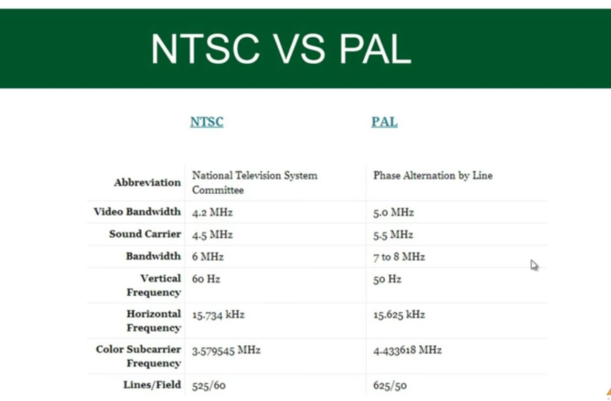

----

TYPES OF VIDEO SIGNALS
==========================

Video signals can be organized in three different ways: Component video, S-video and Composite video.

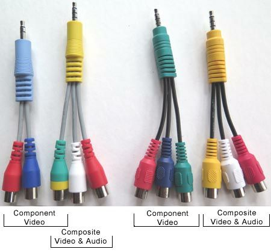

----

Composite video
-----------------

Composite video (one channel) is an analog video transmission (without audio) that carries standard definition video typically at 480i or 576i resolution. Video information is encoded on one channel, unlike the higher-quality S-video (two channels) and the even higher-quality component video (three or more channels).

----

S-Video
--------------

S-Video (also known as separate video and Y/C) is a signaling standard for standard definition video, typically 480i or 576i. By separating the black-and-white and coloring signals, it achieves better image quality than composite video, but has lower color resolution than component video.

----

**S-VIDEO**

.. image:: images/4.png
	:width: 600px
	:class: aligncn

----

Component video
---------------------

Component video is a video signal that has been split into two or more component channels. In popular use, it refers to a type of component analog video (CAV) information that is transmitted or stored as three separate signals. Component video can be contrasted with composite video (NTSC, PAL or SECAM) in which all the video information is combined into a single line level signal that is used in analog television.

----

**CONNECTORS**

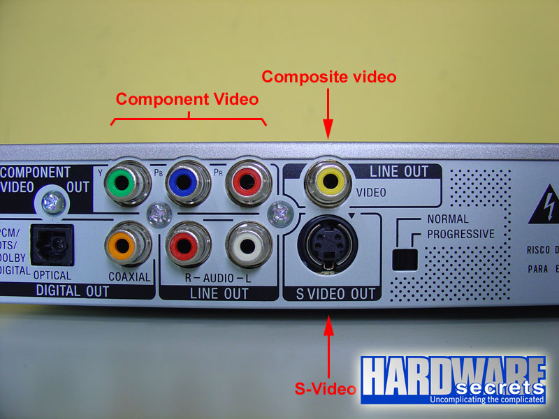

----

**VGA CABLE**

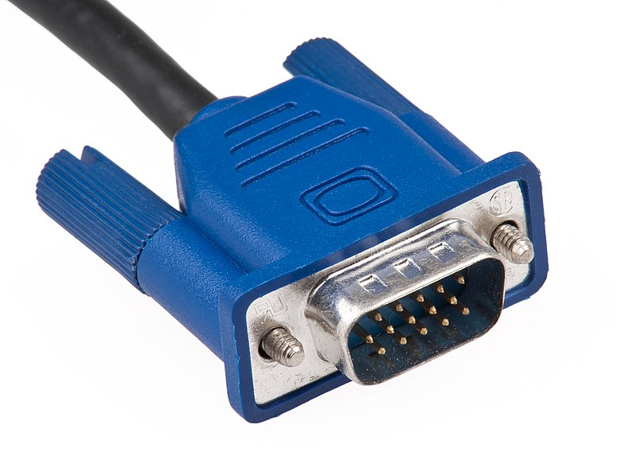

----

HDMI (High-Definition Multimedia Interface)
===============================================

HDMI is a proprietary audio/video interface for transmitting uncompressed video data and compressed or uncompressed digital audio data from an HDMI-compliant source device, such as a display controller, to a compatible computer monitor, video projector, digital television, or digital audio device. HDMI is a digital replacement for analog video standards.

----

Brief Intro to Signals
=========================
Analog and digital signals are used to transmit information, usually through electric signals. In both these technologies, the information, such as any audio or video, is transformed into electric signals.

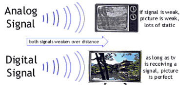

----

**HDMI CONNECTOR PINOUT**

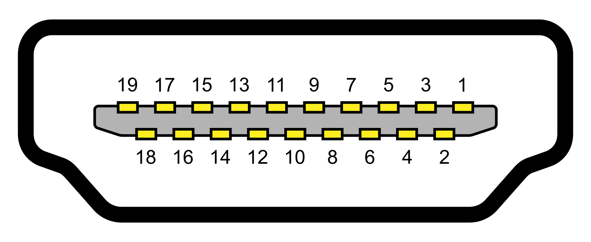

----

:data-x: r0
:data-y: r+1000

DisplayPort
==========================

DisplayPort (DP) is a digital display interface developed by a consortium of PC and chip manufacturers and standardized by the Video Electronics Standards Association (VESA). The interface is primarily used to connect a video source to a display device such as a computer monitor, and it can also carry audio, USB, and other forms of data.

----

:data-x: r+1500
:data-y: r-3000

**DISPLAY PORT CONNECTOR**

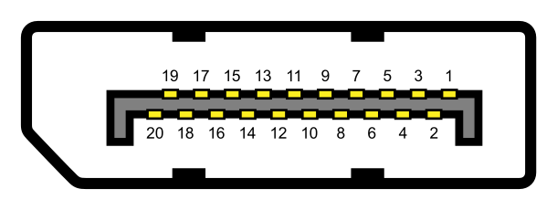

----

**DISPLAY PORT**

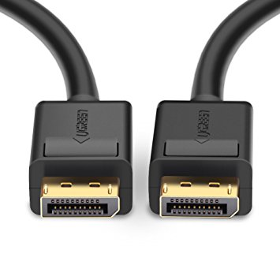

----

With this, We complete my presentation.
=======================================

----

Thank you...
=============
