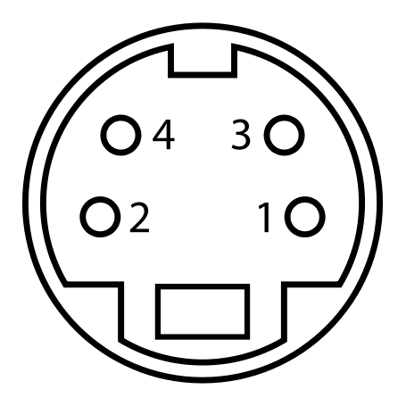

:title: Multimedia 
:data-transition-duration: 1500
:css: hovercraft.css

*MULTIMEDIA PRESENTATION*
===================================

Shivam Aggarwal - 1411073

Abhinav Handa - 1411227

Birjot Singh - 1411246

Deepak Pruthi - 1411248

Gurnoor Singh - 1411254

----

In this presentation we are going to cover chapter: Video 

----

Phase Alternating Line (PAL)
================================

Phase Alternating Line (PAL)  is a colour encoding system for analogue television used in broadcast television systems in most countries broadcasting at 625-line / 50 field (25 frame) per second (576i).

----

**Television encoding systems by nation**

.. image:: images/2.png
	:width: 1200px
	:class: aligncn

----

Composite video
======================

Composite video (one channel) is an analog video transmission (without audio) that carries standard definition video typically at 480i or 576i resolution. Video information is encoded on one channel, unlike the higher-quality S-video (two channels) and the even higher-quality component video (three or more channels).

----

**COMPOSITE VIDEO**

.. image:: images/3.png
	:width: 1200px
	:class: aligncn

----

S-Video
=================

S-Video (also known as separate video and Y/C) is a signaling standard for standard definition video, typically 480i or 576i. By separating the black-and-white and coloring signals, it achieves better image quality than composite video, but has lower color resolution than component video.

----

**S-VIDEO**

----

Component video
==========================

Component video is a video signal that has been split into two or more component channels. In popular use, it refers to a type of component analog video (CAV) information that is transmitted or stored as three separate signals. Component video can be contrasted with composite video (NTSC, PAL or SECAM) in which all the video information is combined into a single line level signal that is used in analog television.

----

**VGA CABLE**

.. image:: images/Vga-cable.jpg
	:width: 800px
	:class: aligncn

----

**SCART**

.. image:: images/SCART.jpg
	:width: 800px
	:class: aligncn

----

HDMI (High-Definition Multimedia Interface)
===============================================

HDMI is a proprietary audio/video interface for transmitting uncompressed video data and compressed or uncompressed digital audio data from an HDMI-compliant source device, such as a display controller, to a compatible computer monitor, video projector, digital television, or digital audio device. HDMI is a digital replacement for analog video standards.

----

Brief Intro to Signals
=========================
Analog and digital signals are used to transmit information, usually through electric signals. In both these technologies, the information, such as any audio or video, is transformed into electric signals.

.. image:: images/7.jpeg
	:width: 400px
	:class: alignrt

----

**HDMI CONNECTOR PINOUT**

----

:data-x: r0
:data-y: r+1000

DisplayPort
==========================

DisplayPort (DP) is a digital display interface developed by a consortium of PC and chip manufacturers and standardized by the Video Electronics Standards Association (VESA). The interface is primarily used to connect a video source to a display device such as a computer monitor, and it can also carry audio, USB, and other forms of data.

----

:data-x: r+1500
:data-y: r-3000

**DISPLAY PORT CONNECTOR**

.. image:: images/DisplayPort_Connector.svg
	:width: 1200px
	:class: aligncn

----

**DISPLAY PORT**

.. image:: images/6.jpeg
	:width: 600px
	:class: aligncn

----

With this, We complete my presentation.
=======================================

----

Thank you...
=============
